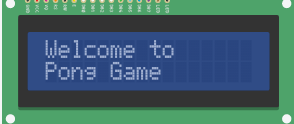
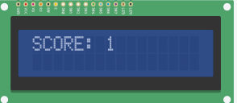
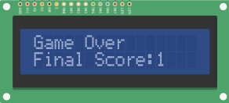
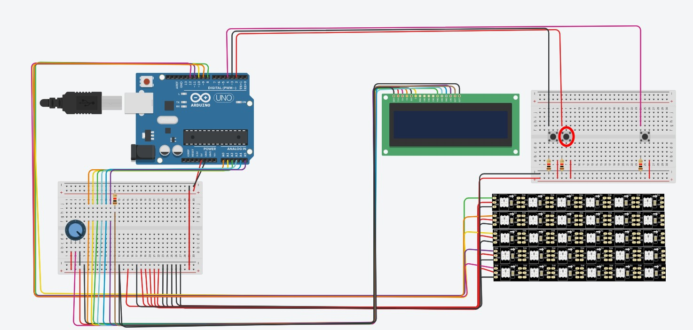

# pong-game

**This repository is the implementation of the pong game in arduino, this project can be run in arduino or a simulator like [tinkercad](https://www.tinkercad.com/).**

**Surce code in tinkercad: https://www.tinkercad.com/things/79ahG2bUkxr**

<!-- TABLE OF CONTENTS -->
## Table of contents

* [About the game](#about-the-project)
* [Circuit](#circuit)
* [Instructions](#instructions)
* [How to play](#how-to-play)
* [Youtube](#youtube)

## About the game
Pong is a table tennis–themed arcade video game, featuring simple two-dimensional graphics, manufactured by Atari and originally released in 1972.

## Circuit

## Instructions
In this game the user controls the lower bar, the objective of this game is the user reach points by making the ball hit the other player`s field, **this is a SINGLE player game**.

* In the begin of the game will be show the welcome message to the player in the lcd display

    

* The score of the player will be showed in the lcd display during the game

    

* The end of the game will be show the total score of the player with the game over message

    

## How to play
* Transfer the [ino](https://github.com/henriquevital00/pong-game/blob/main/pong.ino) file to your arduino or simulator
* Run the arduino

1. **Start, restart and stop the game.**

2. **Move the bar to the left**.

3. **Move the bar to the right**

    

# Youtube

# Enjoy the game

